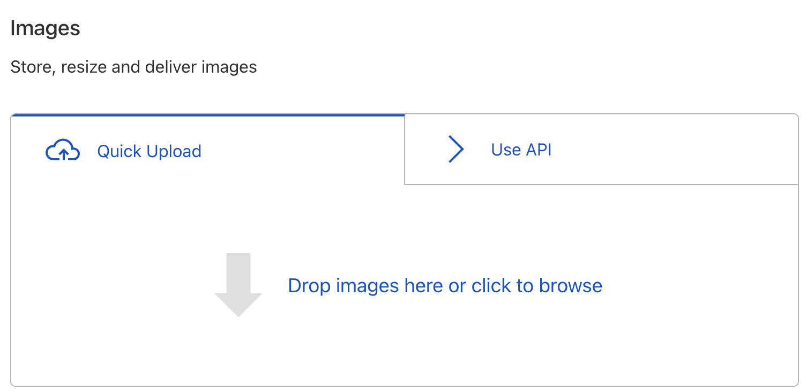
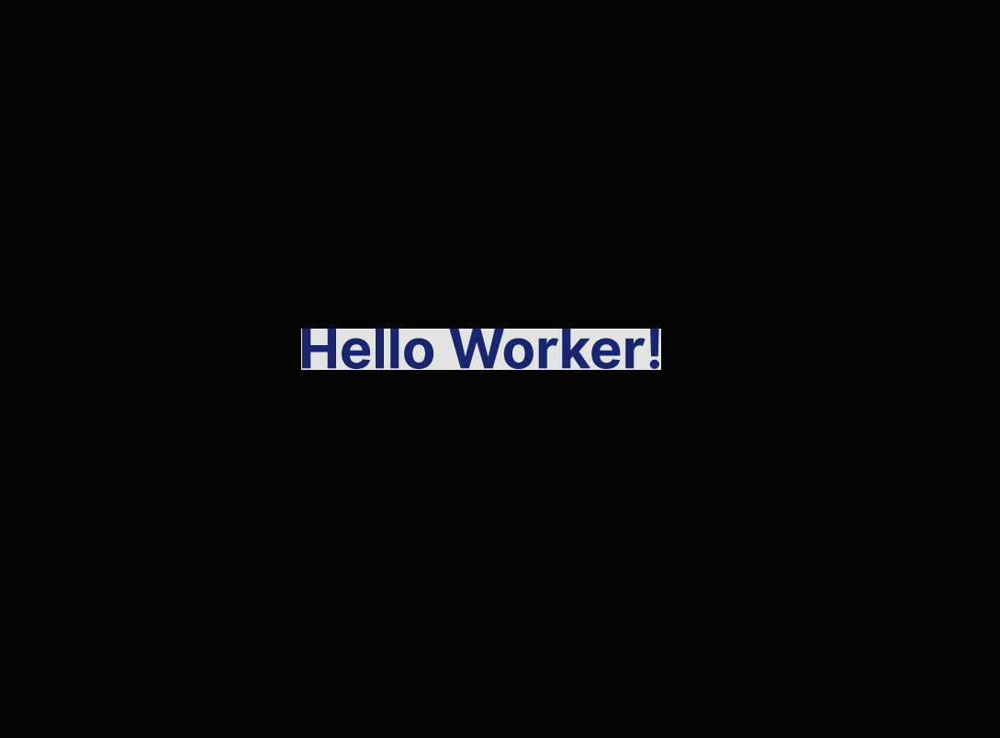
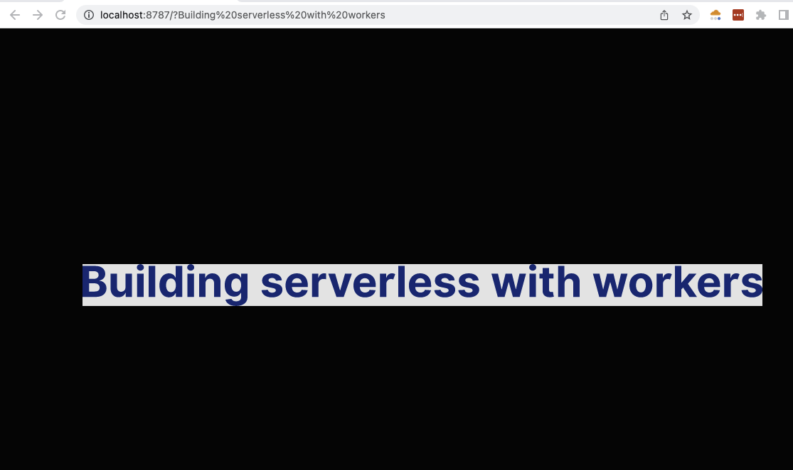

# Generate Youtube Thumbnails with Workers and Cloudflare Image Resizing



## Overview

The media continues to evolve everyday, we consume a lot of video content from different platforms and in a way the thumbnails used for displaying these videos prompts us to click and watch them, depending on how well they are designed, the catchy titles, call-to-actions and images used.

In this tutorial, you will learn how to programmatically generate a custom youtube thumbnail using Cloudlfare Workers and Cloudflare Image Resizing. This tutorial will help you understand how to work with [Images](/images/cloudflare-images/),[Image Resizing](/images/image-resizing/) and [Cloudflare Workers](/workers/).

## Prerequisites

To follow this tutorial, make sure you have Node, Cargo, and [Wrangler](/workers/wrangler/get-started/#install) installed on your machine.

## Learning Goals

- How to upload Images to Cloudflare with the Dashboard or API.
- How to set up a Worker project with Wrangler.
- How to manipulate images with Image Resizing in your Worker.

## Upload your Image

For us to generate a custom thumbnail image, we first need to upload a background image to Cloudflare Images, this will serve as the image we use for transformations to generate the thumbnails.

Cloudflare Images allows you to store, resize, optimize and deliver images in a fast and secure manner. To get started, you can upload your images to the Cloudflare dashboard or use the Upload API to do the same.

### Upload with the Dashboard

1. Log in to your Cloudflare Dashboard, and go to the Images tab.
2. Use the Quick upload tab to add your image, you can either drag and drop or click the section to choose a file from your local files.



3. After the image is uploaded, you can view it using the generated URL.


### Upload with the API

If you choose to use the [API](/images/cloudflare-images/upload-images/upload-via-url), you can upload your image with the **Upload via URL** API,

Below is an example of how to upload an image:

```sh
$ curl --request POST \
 --url https://api.cloudflare.com/client/v4/accounts/<ACCOUNT_ID>/images/v1 \
 --header 'Authorization: Bearer <API_TOKEN>' \
 --form 'url=<PATH_TO_IMAGE>' \
 --form 'metadata={"key":"value"}' \
 --form 'requireSignedURLs=false' 

```

- `ACCOUNT_ID`: is the current user's account id which can be found in your account settings.
- `API_TOKEN`: needs to be generated to scoping Images permission.
- `PATH_TO_IMAGE`: indicate the url for the image you want to upload.

You will then receive a response similar to this:

```json
{
"result": {
 "id": "2cdc28f0-017a-49c4-9ed7-87056c83901",
 "filename": "image.jpeg",
 "metadata": {
   "key": "value":
 },
 "uploaded": "2022-01-31T16:39:28.458Z",
 "requireSignedURLs": false,
 "variants": [
   "https://imagedelivery.net/Vi7wi5KSItxGFsWRG2Us6Q/2cdc28f0-017a-49c4-9ed7-87056c83901/public","https://imagedelivery.net/Vi7wi5KSItxGFsWRG2Us6Q/2cdc28f0-017a-49c4-9ed7-87056c83901/thumbnail"
 ]
},
"success": true,
"errors": [],
"messages": []

}
```

Now that we've uploaded the image we'll be using it as a background for our thumbnail image.

## Create a Worker to Transform text-to-image

The next phase of this tutorial is to create a worker that will enable you to transform text to image so this can be used as an overlay on the background image we uploaded. We will use the [rustwasm-worker-template](https://github.com/cloudflare/rustwasm-worker-template). Go ahead and clone the repository and run it locally.

```sh
$ git clone git@github.com:cloudflare/rustwasm-worker-template.git
```

In the `lib.rs` file, add the following code block:

```rs
---
filename: lib.rs
---
use worker::*;
mod utils;

#[event(fetch)]
pub async fn main(req: Request, env: Env, _ctx: worker::Context) -> Result<Response> {
   // Optionally, get more helpful error messages written to the console in the case of a panic.
   utils::set_panic_hook();

   let router = Router::new();
   router
       .get("/", |_, _| Response::ok("Hello from Workers!"))
       .run(req, env)
       .await
}
```

Next, we'll use [text-to-png](https://github.com/RookAndPawn/text-to-png), a Rust package for rendering text to png as a dependency:

```toml
---
filename: Cargo.toml
---
[dependencies]
text-to-png = "0.2.0"
```

Import it into the `lib.rs` as:


```rs
---
filename: lib.rs
highlight: [1]
---
use text_to_png::{TextPng, TextRenderer};
use worker::*;
mod utils;

#[event(fetch)]
pub async fn main(req: Request, env: Env, _ctx: worker::Context) -> Result<Response> {
   // Optionally, get more helpful error messages written to the console in the case of a panic.
   utils::set_panic_hook();

   let router = Router::new();
   router
       .get("/", |_, _| Response::ok("Hello from Workers!"))
       .run(req, env)
       .await
}
```

Next, we'll create a `handle-slash` function that'll activate the image transformation based on the text passed to the URL as a query parameter.

```rs
---
filename: lib.rs
highlight: [17]
---
use text_to_png::{TextPng, TextRenderer};
use worker::*;
mod utils;

#[event(fetch)]
pub async fn main(req: Request, env: Env, _ctx: worker::Context) -> Result<Response> {
   // Optionally, get more helpful error messages written to the console in the case of a panic.
   utils::set_panic_hook();

   let router = Router::new();
   router
       .get("/", |_, _| Response::ok("Hello from Workers!"))
       .run(req, env)
       .await
}

async fn handle_slash(text: String) -> Result<Response> {}
```

In this function, we'll call the `TextRenderer` by assigning it to a renderer value, specifying that we want to use a custom font. Following that, we'll use the `render_text_to_png_data` method to transform the text into image format.

```rs
---
filename: lib.rs
highlight: [17, 18, 19, 20, 21, 22, 23, 24]
---
use text_to_png::{TextPng, TextRenderer};
use worker::*;
mod utils;

#[event(fetch)]
pub async fn main(req: Request, env: Env, _ctx: worker::Context) -> Result<Response> {
   // Optionally, get more helpful error messages written to the console in the case of a panic.
   utils::set_panic_hook();

   let router = Router::new();
   router
       .get("/", |_, _| Response::ok("Hello from Workers!"))
       .run(req, env)
       .await
}

async fn handle_slash(text: String) -> Result<Response> {
  let renderer = TextRenderer::try_new_with_ttf_font_data(include_bytes!("../assets/Inter-Bold.ttf"))
    .expect("Example font is definitely loadable");

  let text_png: TextPng = renderer.render_text_to_png_data(text.replace("+", " "), 60, "003682").unwrap();
}
```

Here, we're setting the headers to `content-type: 'image/png'` so the text displayed on the browser is a png image.

```rs
---
filename: lib.rs
highlight: [23, 24, 25, 26]
---
use text_to_png::{TextPng, TextRenderer};
use worker::*;
mod utils;

#[event(fetch)]
pub async fn main(req: Request, env: Env, _ctx: worker::Context) -> Result<Response> {
   // Optionally, get more helpful error messages written to the console in the case of a panic.
   utils::set_panic_hook();

   let router = Router::new();
   router
       .get("/", |_, _| Response::ok("Hello from Workers!"))
       .run(req, env)
       .await
}

async fn handle_slash(text: String) -> Result<Response> {
  let renderer = TextRenderer::try_new_with_ttf_font_data(include_bytes!("../assets/Inter-Bold.ttf"))
    .expect("Example font is definitely loadable");

  let text_png: TextPng = renderer.render_text_to_png_data(text.replace("+", " "), 60, "003682").unwrap();

  let mut headers = Headers::new();
  headers.set("content-type", "image/png")?;

  Ok(Response::from_bytes(text_png.data)?.with_headers(headers))
}
```

The final lib.rs file should look as follows (you can also find the full code as an example repository at [github.com/lauragift21/worker-to-text](https://github.com/lauragift21/worker-to-text)).

```rs
---
filename: lib.rs
---
use text_to_png::{TextPng, TextRenderer};
use worker::*;

mod utils;

#[event(fetch)]
pub async fn main(req: Request, env: Env, _ctx: worker::Context) -> Result<Response> {
    // Optionally, get more helpful error messages written to the console in the case of a panic.
    utils::set_panic_hook();

    let router = Router::new();

    router
        .get_async("/", |req, _| async move {
            if let Some(text) = req.url()?.query() {
                handle_slash(text.into()).await
            } else {
                handle_slash("Hello Worker!".into()).await
            }
        })
        .run(req, env)
        .await
}

async fn handle_slash(text: String) -> Result<Response> {
    let renderer = TextRenderer::try_new_with_ttf_font_data(include_bytes!("../assets/Inter-Bold.ttf"))
    .expect("Example font is definitely loadable");

    let text = if text.len() > 128 {
        "Nope".into()
    } else {
        text
    };

    let text = urlencoding::decode(&text).map_err(|_| worker::Error::BadEncoding)?;

    let text_png: TextPng = renderer.render_text_to_png_data(text.replace("+", " "), 60, "003682").unwrap();

    let mut headers = Headers::new();
    headers.set("content-type", "image/png")?;

    Ok(Response::from_bytes(text_png.data)?.with_headers(headers))
}
```

Let's run the code with the command:

```sh
$ wrangler dev
```

This should spin up a localhost instance with the image displayed:



Adding a query parameter with custom text we get:



Run the wrangler publish command to publish the worker so we get a custom domain generated. We'll use it in the main thumbnail image.

```sh
$ wrangler publish
```

## Create a Worker to Display the Original Image

Let's create another worker that'll do the job of serving the image we uploaded to Images.

```sh
$ wrangler init thumbnail-image
```

This will create a new worker javascript project. In the index.js file, add the following code block:

```js
---
filename: index.js
---
export default {
 async fetch(request, env) {
   const url = new URL(request.url)
   if (url.pathname === '/original-image') {
     const image = await fetch(
       `https://imagedelivery.net/${env.CLOUDFLARE_ACCOUNT_HASH}/${IMAGE_ID}/public`
     );
     return image;
   }
   return new Response('Image Resizing with a Worker')
 }
}
```

Where the `env.CLOUDFLARE_ACCOUNT_HASH` is your Cloudflare Account Id and the `env.IMAGE_ID` is the image id you got from the Cloudflare's dashboard.


When you run your worker, and navigate to the `/original-image` route, you should see the image displayed.

## Write a function to dynamically add custom text on Image

In this part of the tutorial, we'll use the [image resizing service](/images/image-resizing/) to draw custom text as an overlay on the image. Let's start by displaying the resulting image on a different route. I'll call the new route - **thumbnail**.


```js
---
filename: index.js
highlight: [11]
---
export default {
 async fetch(request, env) {
   const url = new URL(request.url)
   if (url.pathname === '/original-image') {
     const image = await fetch(
       `https://imagedelivery.net/${env.CLOUDFLARE_ACCOUNT_HASH}/${IMAGE_ID}/public`
     );
     return image;
   }

   if (url.pathname === '/thumbnail') { }

   return new Response('Image Resizing with a Worker')
 }
}
```

Next, we'll use the fetch method to apply the changes on top of the image. The overlay options are nested in options.cf.image.

```js
---
filename: index.js
highlight: [12, 13, 14, 15, 16, 17, 18]
---
export default {
 async fetch(request, env) {
   const url = new URL(request.url)

   if (url.pathname === '/original-image') {
     const image = await fetch(
       `https://imagedelivery.net/${env.CLOUDFLARE_ACCOUNT_HASH}/${IMAGE_ID}/public`
     );
     return image;
   }

  if (url.pathname === '/thumbnail') {
    fetch(imageURL, {
      cf: {
        image: {}
      }
    })
  }

   return new Response('Image Resizing with a Worker')
 }
}
```

The **`imageURL`** is the URL of the image you want to use as a background and where you have the `cf.image` object, there you can specify the options you want to apply to the image.



At the time of this writing, **Cloudflare Image Resizing** doesn't allow resizing images in a worker that is stored in Cloudflare Images. So instead of using the image we served on the `/original-image` route, we'll use the same image from a different source.



We'll use GitHub as the source for the background image, add the image you want to use as the background in an assets directory and push your changes to GitHub. Copy the url version of the image upload, you'll get this when you click on the image file and check the remote url option.


Now, replace the imageURL with the URL in your clipboard.


```js
---
filename: index.js
highlight: [2, 3]
---
if (url.pathname === '/thumbnail') {
 const imageURL = “https://github.com/lauragift21/social-image-demo/blob/1ed9044463b891561b7438ecdecbdd9da48cdb03/assets/cover.png?raw=true”
 fetch(imageURL, {
   cf: {
     image: {}
   }
 })
}
```

Next, we'll add overlay options in the image object. Resize the image to the preferred width and height for Youtube thumbnails and use the [draw](/images/image-resizing/draw-overlays/#draw-options) option to add overlay text using the deployed URL of our **`text-to-image`** Worker.

```js
---
highlight: [3, 4, 5, 6, 7, 8, 9, 10, 11, 12]
---
fetch(imageURL, {
 cf: {
   image: {
     width: 1280,
     height: 720,
     draw: [
       {
         url: 'https://text-to-image.examples.workers.dev',         
         left: 40,
       },
     ],
   },
 },
});
```

Image Resizing can only be tested when you deploy your worker, so we'll go ahead and run the command:

```sh
$ wrangler publish
```

The command deploys your worker and returns a custom .dev domain. We'll head over to the domain and navigate to the `/thumbnail` route.

You should see the resized image with the text hello workers!


This is great!, but we also want the text applied to be dynamic meaning we can change it to any text and it'll update the image shown.

To add dynamic text, we'll append any text attached to the `/thumbnail` url using query parameters and pass it down to the text-to-image worker url as a parameter.


```js
for (const title of url.searchParams.values()) {
  try {
    const editedImage = await fetch(imageURL, {
      cf: {
        image: {
          width: 1280,
          height: 720,
          draw: [
            {
              url: `https://text-to-image.examples.workers.dev/?${title}`,
              left: 50
            }
          ],
        },
      },
    });
    return editedImage;
  } catch (error) {
    console.log(error);
  }
}
```

This will always return the text you pass as a query string in the generated image. Here's an example, [the following url](https://socialcard.cdnuptime.com/thumbnail?Getting%20Started%20With%20Cloudflare%20Images) will generate this image:


There you go! You've successfully made a custom youtube thumbnail generator for yourself.

## Taking it one step forward: Service for anyone to use

This is a very useful tool for anyone creating content on Youtube, you can use this as a one-time service for generating the thumbnails you add to the videos you upload. It's very flexible as you can change the background anytime you want and add more custom text if you want to. Feel free to take this tutorial, play around with it and see how you can use it for your specific use case.

## Related Resources

In this tutorial, you learned how to use Cloudflare Workers and Cloudflare Image Resizing to generate custom Youtube thumbnails. To learn more about Cloudflare Workers and Image resizing, refer to the following resources:

- [Cloudflare Workers Documentation](/workers/)
- [Draw overlay and watermarks](/images/image-resizing/draw-overlays/)
- [Resize Image with a Worker](/images/image-resizing/resize-with-workers/)